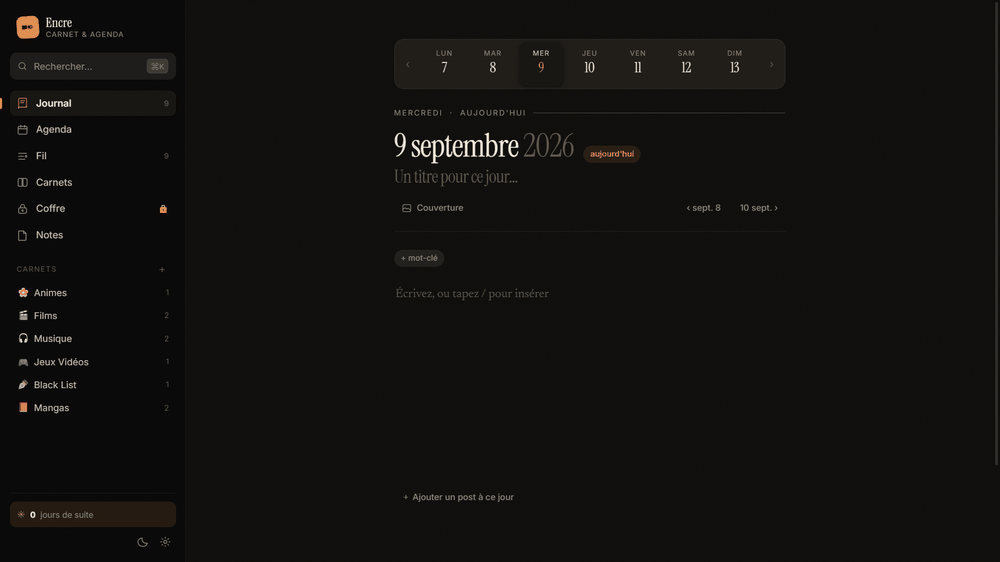

# Encre

Carnet et agenda personnels : une page par jour, un fil de posts courts, des
carnets thématiques, des pages libres et un espace chiffré. Tout est stocké
dans le navigateur — aucune donnée ne quitte la machine.

HTML, CSS et JavaScript. **Aucune dépendance, aucune étape de build.** Le seul
composant serveur est un script Python de 415 lignes, optionnel, qui n'utilise
que la bibliothèque standard.

→ [Guide d'utilisation complet](GUIDE.md)



## Lancer

```bash
python serveur.py
```

Puis http://localhost:5173. Ouvrir `index.html` directement fonctionne aussi,
en mode dégradé (voir « Le relais local » plus bas).

## Architecture

```
index.html          ordre de chargement des modules
serveur.py          fichiers statiques + relais HTTP
assets/css/         style.css (tokens, thèmes) · components.css · views.css
assets/js/
  util.js           DOM, dates FR, modales, toasts
  media.js          images : IndexedDB, redimensionnement, cache d'URL
  store.js          état, persistance, thèmes, export/import
  embed.js          analyse des liens → intégrations
  coffre.js         chiffrement (PBKDF2 + AES-GCM)
  gallery.js        agencements d'images + visionneuse
  editor.js         éditeur par blocs, menu « / », raccourcis markdown
  view-*.js         une vue par espace
  app.js            routeur, palette ⌘K, raccourcis clavier
```

Chaque module est une IIFE qui s'accroche à un namespace global unique et
expose une petite surface publique. Les scripts sont chargés dans l'ordre de
leurs dépendances ([index.html:126](index.html#L126)) : `util` → `media` →
`store` → … → `app`. Pas d'`import`, donc pas de bundler, donc rien à
recompiler entre deux modifications — un rechargement suffit. Les URL portent
un numéro de version, incrémenté à chaque modification, pour invalider le
cache du navigateur.

Le routeur ([app.js](assets/js/app.js)) tient dans une table
`route → render(mount, params)` et se synchronise sur `location.hash`. Ajouter
un espace, c'est écrire un `view-*.js` qui expose `render` et l'inscrire dans
la table.

## Décisions techniques

### Séparer l'état structuré des binaires

Le texte, les métadonnées et les réglages vivent dans `localStorage` sous une
seule clé versionnée (`encre:data:v1`) : petit, synchrone, facile à exporter en
un `JSON.stringify`. Les images et vidéos vont dans **IndexedDB**
([media.js](assets/js/media.js)), avec repli sur `localStorage` si l'ouverture
échoue ou dépasse 4 secondes.

Mélanger les deux aurait fait exploser le quota de `localStorage` (~5 Mo) dès
la première galerie. Les images sont redimensionnées à 1800 px sur le côté le
plus long avant stockage, et les URL objet sont mises en cache pour éviter de
recréer un blob à chaque rendu.

### Le coffre

Le contenu du coffre n'est jamais écrit en clair
([coffre.js](assets/js/coffre.js)) :

- clé dérivée du code par **PBKDF2-SHA256, 250 000 itérations**, sel aléatoire
  stocké à côté du chiffré ;
- chiffrement **AES-GCM 256**, IV aléatoire de 12 octets régénéré à chaque
  écriture et préfixé au message ;
- la `CryptoKey` est dérivée non extractible et ne vit qu'en mémoire — elle
  n'est jamais sérialisée ;
- verrouillage automatique après 10 minutes d'inactivité et à la fermeture de
  l'onglet ;
- les images du coffre sont chiffrées elles aussi : sur le disque, ce sont des
  octets, pas des fichiers image ;
- changer le code **rechiffre** tout le contenu plutôt que de re-dériver une
  clé sur des données existantes.

### Distinguer un coffre vide d'un coffre illisible

Le témoin (`verif`) prouve que le code est bon avant même de toucher au
contenu. Quand le code est validé mais que la charge, elle, ne se déchiffre
plus, c'est donc une corruption — pas une erreur de saisie.

Traiter les deux cas de la même façon serait destructeur : le coffre paraîtrait
vide, l'utilisateur écrirait dedans, et la première sauvegarde remplacerait le
seul exemplaire d'un chiffré peut-être récupérable par une liste vide. Le
coffre s'ouvre donc en **lecture seule** :

- `sauver()` est le point de passage unique de toute écriture, et refuse
  d'écrire tant que la charge est illisible ;
- créer, supprimer une page, ajouter ou retirer un média lèvent une erreur
  explicite plutôt que d'échouer en silence ;
- **changer le code est refusé** — dériver une nouvelle clé condamnerait
  définitivement l'ancien contenu ;
- la vue affiche ce qui s'est passé et la marche à suivre, au lieu d'un coffre
  d'apparence vide.

Le changement de code applique le même principe aux médias : tout est
déchiffré *avant* de dériver la nouvelle clé, et un seul échec annule
l'opération. Au-delà de ce point, l'ancien sel est perdu et ce qui n'a pas été
relu ne sera plus jamais déchiffrable.

**Ce que ça protège, et ce que ça ne protège pas.** Le modèle de menace est
l'accès local au stockage du navigateur : quelqu'un qui ouvre les outils de
développement ou lit le profil sur le disque ne voit que du chiffré. Ça ne
protège pas contre un attaquant qui exécute du code dans la page pendant que le
coffre est ouvert — la clé est alors en mémoire. Le code n'étant stocké nulle
part, il n'est pas réinitialisable : l'oublier, c'est perdre le contenu.

`crypto.subtle` n'est exposé que sur une origine sûre : le coffre exige donc le
serveur local et le dit explicitement plutôt que d'échouer silencieusement.

### Le relais local

Letterboxd et X ne publient ni oEmbed ni en-têtes CORS : le navigateur ne peut
pas lire leurs pages depuis `file://` ou `localhost`. `serveur.py` fait la
requête à leur place et en extrait les données (`/api/letterboxd`, `/api/x`,
`/api/img`).

C'est un relais, pas un proxy ouvert :

- **allowlist d'hôtes** en dur ([serveur.py:32](serveur.py#L32)) — les pages
  n'acceptent que `letterboxd.com`, les images que les CDN `ltrbxd.com` ;
- écoute sur `127.0.0.1` uniquement ;
- les affiches et avatars récupérés sont **rangés hors ligne** dès le premier
  appel : aucune requête réseau aux rechargements suivants, et le contenu
  survit à la disparition de la source.

Sans le relais, l'application reste fonctionnelle et retombe sur des solutions
dégradées annoncées comme telles (titre déduit de l'URL, iframe officielle de X).

### Rendu natif plutôt qu'iframe

Un lien X est dessiné par Encre avec ses propres styles à partir du contenu
public récupéré par le relais, au lieu d'être encapsulé dans l'iframe
officielle. La carte fait alors exactement la hauteur de son contenu — pas de
barre de défilement interne, pas de bloc vide sous le tweet, et pas de script
tiers chargé dans la page.

Le prix de ce choix est assumé : l'extraction dépend de la structure HTML de la
source et cassera si elle change. C'est pourquoi le repli sur l'iframe existe.

## Tests

```bash
node --test tests/coffre.test.js
```

21 tests sur le coffre, en moins de trois secondes. Node 18 ou plus récent, et
toujours aucune dépendance : `node --test` est intégré au runtime et
`crypto.subtle` y est le même que dans le navigateur — les tests exercent le
vrai AES-GCM et le vrai PBKDF2, pas une simulation.

`tests/harness.js` charge `coffre.js` hors du navigateur en lui fournissant
des doublures pour ses deux seules dépendances, le magasin d'état et le
stockage des médias. Le chargement passe par `new Function` plutôt que par
`node:vm` : un contexte vm créerait des `Uint8Array` d'un autre realm, que
WebCrypto refuse.

Ce que la suite couvre :

| Ce qui est vérifié | Pourquoi ça compte |
| --- | --- |
| Sel de 16 octets, 250 000 itérations | Les paramètres de dérivation ne peuvent pas être affaiblis en silence |
| Deux coffres, même code, sels différents | Pas de clé réutilisable d'une installation à l'autre |
| Aller-retour fermer / ouvrir | Le contenu survit au verrouillage |
| Mauvais code rejeté | Le témoin fait son travail |
| **Rien en clair sur le disque** | La promesse centrale du coffre |
| IV différent à chaque écriture | Deux sauvegardes identiques restent indistinguables |
| Un octet modifié invalide le message | AES-GCM est authentifié, pas seulement chiffrant |
| **Une charge corrompue n'est jamais écrasée** | Le coffre passe en lecture seule au lieu de paraître vide |
| Écritures et changement de code refusés en lecture seule | Aucun chemin ne contourne la protection |
| Un coffre légitimement vide reste inscriptible | La protection ne se déclenche pas à tort |
| Un média illisible annule le changement de code | Le sel n'est pas remplacé tant que tout n'a pas été relu |
| Changement de code | Le contenu est rechiffré, l'ancien code ne rouvre rien |
| Médias chiffrés au repos | Une image du coffre n'est plus une image sur le disque |

La suite a été validée par mutation : passer l'IV en constante, abaisser les
itérations à 1 000 ou retirer l'appel de chiffrement font bien échouer les
tests concernés.

Cette dernière vérification a servi. Le test « rien en clair » ne cherchait
d'abord la chaîne secrète que dans l'état sérialisé — il passait donc alors
même que le contenu était stocké sans chiffrement, simplement encodé en
base64. Il décode désormais ce qui est réellement écrit avant de vérifier.

## Limites connues

- **La couverture s'arrête au coffre.** L'éditeur, le magasin d'état et
  l'analyse des liens ne sont pas testés.
- **Pas de synchronisation.** Les données vivent dans un seul navigateur ; la
  seule migration est l'export/import JSON. Vider les données de site efface
  le carnet.
- L'extraction Letterboxd et X repose sur la structure HTML des pages sources,
  donc fragile par construction.
- `editor.js` (903 lignes) concentre le modèle de blocs, le glisser-déposer et
  les raccourcis markdown — c'est le fichier qui mériterait d'être découpé en
  premier.

## Licence

MIT — voir [LICENSE](LICENSE).
